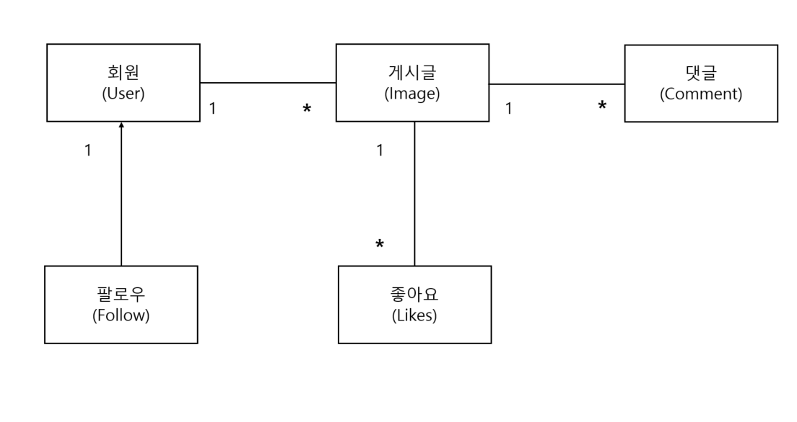
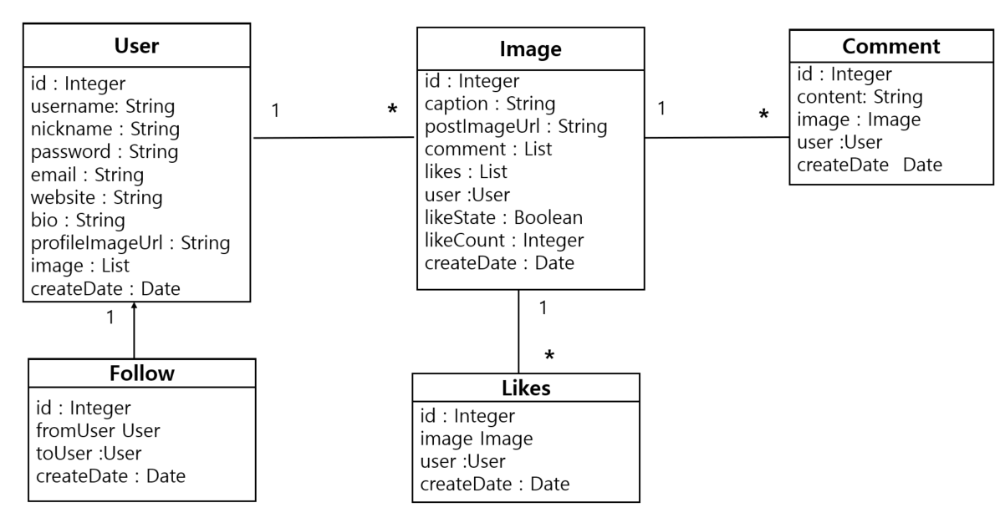
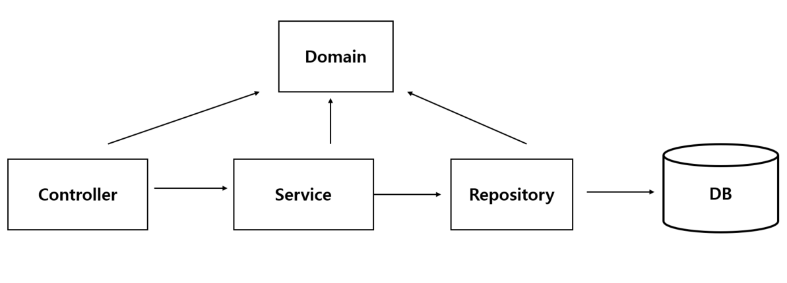
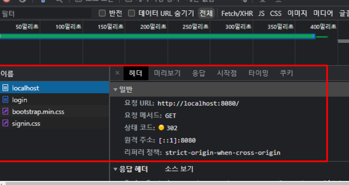

# Photogram

### 도메인 모델



- 회원은 여러 게시글을 등록할 수 있다. (일대다 양방향)
- 회원은 여러 회원을 팔로우 할 수 있다. (일대다 단방향)
- 게시글에는 여러 개의 댓글을 달 수 있다. (일대다 양방향)
- 게시글에는 여러 회원이 좋아요를 누를 수 있다. (일대다 양방향)

### 엔티티



### 애플리케이션 아키텍처



- controller  :  웹 계층
- service : .비즈니스 로직 , 트랜잭션 처리
- repository : JPA를 직접 사용하는 계층  , querydsl , native query 사용
- domain : 엔티티가 모여 있는 계층 , 모든 계층에서 사용


### 기능


<details>
<summary>회원가입</summary>

### 시큐리티 세팅

```xml
<dependency>
    <groupId>org.springframework.boot</groupId>
    <artifactId>spring-boot-starter-security</artifactId>
</dependency>
```

- 클라이언트가 서버에 요청하면 /login 으로 redirect 된다.



### 시큐리티 커스텀 하기

```java
@EnableWebSecurity
@Configuration // IOC
public class SecurityConfig extends WebSecurityConfigurerAdapter {
}

```

- WebSecurityConfigureAdapter 를 상속받으면 시큐리티 설정파일로 인식이 된다.
- @Configuration 으로 해당 클래스를 IoC 컨테이너에 등록
- @EnableWebSecurity 로 시큐리티 설정파일로 인식된 파일을 활성화 시킴

```java
@EnableWebSecurity
@Configuration // IOC
public class SecurityConfig extends WebSecurityConfigurerAdapter {
  @Override
  protected void configure(HttpSecurity http) throws Exception {
    http.
            formLogin().disable()
            .httpBasic().disable()
            .csrf().disable()
            .sessionManagement().sessionCreationPolicy(SessionCreationPolicy.STATELESS)
            .and()
            .exceptionHandling()
            .authenticationEntryPoint(jwtAuthenticationEntryPoint)
            .accessDeniedHandler(jwtAccessDeniedHandler)
            .and()
            .addFilter(corsConfig.corsFilter())
            .addFilterBefore(new JWTAuthenticationFilter(tokenHelper) , UsernamePasswordAuthenticationFilter.class)

            .authorizeRequests()
            .antMatchers("/api/user/**","/user/**","/image/**","/subscribe/**","/comment/**,/api/**")
            .authenticated()
            .anyRequest().permitAll();
  }
}
```


### CSRF 토큰 해제

- 클라이언트가 웹 서버로 회원가입 데이터를 전송한다.
- 웹 서버를 보호하고 있는 시큐리티가 입구에서 시큐리티 CSRF 토큰 검사를 실시한다.
- CSRF 토큰 검사는 클라이언트가 
웹 서버가 응답해준 회원가입창을 통해서 정상적인 경로로 회원가입을 진행했는지 확인하는 것이다.
- 클라이언트가 응답 받았을 때 CSRF가 붙어서 전해지는 것이다.

```java
@Override
    protected void configure(HttpSecurity http) throws Exception {
        http.csrf().disable(); // CSRF 토큰 검사 비활성화
    }
```

- 시큐리티가 제공하는 CSRF 토큰 검사 기능을 비활성화 하자


</details>


<br/>

<details>
<summary>회원 정보 수정</summary>


### dto

```java
public class UserProfileUpdateResponse {
    private int id;
    private String username;
    private String nickname;
    private String bio;
    private String email;
    private String website;
    private String profileImageUrl;
}

```

### 회원 정보 수정 페이지

회원 정보 수정 페이지 렌더링에 필요한 데이터

- 고유 key (primary key) 
- 소개
- 닉네임
- 아이디
- 이메일
- 웹 사이트
- 프로필 이미지 url

```java
@GetMapping("/api/user/profile")
    public ResponseEntity<?> update(@AuthenticationPrincipal PrincipalDetails principalDetails) {
        if(principalDetails.getUser() == null){
            throw new CustomApiException("로그인이 필요합니다");
        }
        User user = principalDetails.getUser();
        UserProfileUpdateResponse profileUpdateResponse = UserProfileUpdateResponse.builder()
                .bio(user.getBio())
                .id(user.getId())
                .username(user.getUsername())
                .nickname(user.getNickname())
                .email(user.getEmail())
                .profileImageUrl(user.getProfileImageUrl())
                .website(user.getWebsite()).build();


        return new ResponseEntity<>(new RespDto<>(1,"유저 프로필 조회",profileUpdateResponse),HttpStatus.OK);
    }
```

</details>


<br/>


<details>
<summary>사용자 검색/프로필 조회</summary>

### controller 

- 프로필 조회 했을 때 로그인 한 유저의 프로필 여부에 따라 화면이 다름
- 따라서 AuthenticationPrincipal 객체가 필요함

```java
    @GetMapping("/api/user/{pageUserId}")
    public ResponseEntity<?> profile(@AuthenticationPrincipal PrincipalDetails principalDetails, @PathVariable int pageUserId) {
        UserProfileDto dto = userService.selectUserProfile(pageUserId, principalDetails.getUser().getId());
        return new ResponseEntity<>(new RespDto<>(1,"유저 프로필 조회",dto),HttpStatus.OK);
    }
```

### service

- 프로필 유저 정보 
- 로그인 한 유저의 프로필 여부
- 게시물 개수
- 해당 프로필 유저의 팔로잉 상태 여부
- 해당 프로필 유저의 팔로잉 수
- 해당 프로필 유저의 팔로워 수

```java
 @Transactional(readOnly = true)
    public UserProfileDto selectUserProfile(int pageUserId, int principalId){
        UserProfileDto dto = new UserProfileDto();
        User userEntity = userRepository.findById(pageUserId).orElseThrow(() -> {
            throw new CustomApiException("해당 프로필 페이지는 없는 페이지입니다.");
        });
        dto.setUser(userEntity);
        dto.setPageOwner(pageUserId == principalId);
        dto.setImageCount(userEntity.getImages().size());

        int followState = followRepository.followState(principalId, pageUserId);
        int followingCount = followRepository.followingCount(pageUserId);
        int followerCount = followRepository.followerCount(pageUserId);

        dto.setFollowState(followState == 1);
        dto.setFollowingCount(followingCount);
        dto.setFollowerCount(followerCount);

        // 좋아요 개수
        userEntity.getImages().forEach(image -> {
            image.setLikeCount(image.getLikes().size());
        });
        return dto;
    }
```

</details>


<br/>


<details>
<summary>팔로우 하기/취소</summary>

### 팔로우 모델

```java
public class Follow {
  @Id
  @GeneratedValue(strategy = GenerationType.IDENTITY)
  private int id;

  @JoinColumn(name = "fromUserId")
  @ManyToOne(fetch = FetchType.LAZY)
  private User fromUser;

  @JoinColumn(name = "toUserId")
  @ManyToOne(fetch = FetchType.LAZY)
  private User toUser;

  private LocalDateTime createDate;

  @PrePersist // 디비에 INSERT 되기 직전에 실행
  public void createDate() {
    this.createDate = LocalDateTime.now();
  }
}
```
같은 사람을 계속해서 팔로우 하면 안되기 때문에 Unique 제약 조건을 설정하였다.
```java
@Table(
        uniqueConstraints = {
                @UniqueConstraint(
                        name = "subscribe_uk",
                        columnNames = {"fromUserId" ,"toUserId"}
                )
        }
)
public class Follow {
}
```

실제 데이터베이스 컬럼명을 적어야 함

### 팔로우 API 

#### Controller

```java
@RestController
@RequiredArgsConstructor
public class FollowApiController {

  private final FollowService followService;

  @PostMapping("/api/subscribe/{toUserId}")
  public ResponseEntity<?> follow(@AuthenticationPrincipal PrincipalDetails principalDetails , @PathVariable int toUserId){
    followService.follow(principalDetails.getUser().getId() , toUserId);
    return new ResponseEntity<>(new RespDto<>(1, "팔로우 성공",null), HttpStatus.OK);
  }

  @DeleteMapping("/api/subscribe/{toUserId}")
  public ResponseEntity<?> unfollow(@AuthenticationPrincipal PrincipalDetails principalDetails , @PathVariable int toUserId) {
    System.out.println("principalDetails = " + principalDetails);
    followService.unfollow(principalDetails.getUser().getId() , toUserId);
    return new ResponseEntity<>(new RespDto<>(1, "팔로우 취소 성공",null), HttpStatus.OK);
  }
}
```


#### Repository

네이티브 쿼리 사용

- 팔로우 하기
- 팔로우 취소

```java
public interface FollowRepository extends JpaRepository<Follow,Integer> ,FollowRepositoryCustom{

  @Modifying
  @Query(value = "insert into follow(fromUserid ,toUserId , createDate) values(:fromUserId, :toUserId , now())", nativeQuery = true)
  void mFollow(int fromUserId, int toUserId);

  @Modifying
  @Query(value = "delete from  follow where fromUserId =:fromUserId and toUserId =:toUserId", nativeQuery = true)
  void mUnfollow(int fromUserId , int toUserId);
}
```

</details>


<br/>

<details>
<summary>팔로우한 유저 게시물 보기</summary>

### Querydsl 사용 - 서브쿼리 

- 팔로우 한 유저 아이디 가져오기 (Follow 테이블)
```java
queryFactory
.select(follow.toUser.id)
.from(follow)
.where(follow.fromUser.id.eq(principalId))
.fetch();
```
- Image 테이블에서 userId 가 팔로우 한 유저 아이디에 해당하는 정보 가져오기
  - 서브 쿼리 사용
  - 게시물 업로드 최신 순으로 가져오기
```java
queryFactory
.selectFrom(image)
.where(image.user.id.in(JPAExpressions.select(follow.toUser.id).from(follow)
.where(follow.fromUser.id.eq(principalId)))).orderBy(image.createDate.desc()).fetch();
```


</details>


<br/>


<details>
<summary>좋아요 많은 인기 게시물</summary>

### 응답 dto

```java
@Data
@NoArgsConstructor
@AllArgsConstructor
public class ImagePopularDto {

    private int id;
    private String caption;
    private String postImageUrl;
    private long likeCount;
    private User user;
}
```

### querydsl 로 데이터 조회

- 좋아요 테이블 (likes) 에서 imageId로 그룹화하기
- 좋아요 테이블 (likes) 과 게시물 테이블 (Images) 조인화기
- imageId로 그룹화 한 뒤 count 개수로 정렬
- 좋아요 개수가 같을 경우 게시물 등록 최신 순 정렬
- 개수는 9개만 (limit = 9)

```java
queryFactory
                .select(Projections.fields(ImagePopularDto.class,
                        image.id, image.caption , image.postImageUrl, image.user
                        , likes.image.id.count().as("likeCount")))
                .from(image)
                .innerJoin(likes)
                .on(image.id.eq(likes.image.id))
                .groupBy(likes.image.id)
                .orderBy(likes.image.id.count().desc(), image.createDate.desc())
                .limit(9)
                .fetch();
```


</details>


<br/>

<details>
<summary>댓글 등록/삭제</summary>

### 댓글 도메인

- 하나의 유저는 N개의 댓글을 등록할 수 있다.
- 하나의 게시글(이미지)에는 N개의 댓글이 등록 될 수 있다.

```java
public class Comment {
  @Id
  @GeneratedValue(strategy = GenerationType.IDENTITY)
  private int id;

  @Column(length = 100 , nullable = false)
  private String content;

  @JsonIgnoreProperties({"images"})
  @JoinColumn(name = "userId")
  @ManyToOne(fetch = FetchType.LAZY)
  private User user;

  @JoinColumn(name = "imageId")
  @ManyToOne(fetch = FetchType.LAZY)
  private Image image;
  private LocalDateTime createDate;

  @PrePersist
  public void createDate(){
    this.createDate = LocalDateTime.now();
  }

  public static Comment addComment(String content , Image image ,User user){
    Comment comment = new Comment();
    comment.setContent(content);
    comment.setImage(image);
    comment.setUser(user);
    return comment;
  }
}
```

- 댓글 등록을 위한 addComment 메서드 생성

### 댓글 등록 / 삭제

- 댓글 등록을 위한 dto
```java
public class CommentDto {
    @NotBlank // 빈 값이거나 null 체크 , 빈 공백
    private String content;
    @NotNull // 빈 값 체크
    private Integer imageId;
}

```
- 컨트롤러에서 댓글 등록 서비스 호출
- 유효성 검사 AOP 처리
```java
@PostMapping("/api/comment")
public ResponseEntity<?> commentService(
@Valid @RequestBody CommentDto commentDto, BindingResult bindingResult,
@AuthenticationPrincipal PrincipalDetails principalDetails) {
        Comment comment = commentService.write(commentDto.getContent(), commentDto.getImageId(), principalDetails.getUser().getId());
        return new ResponseEntity<>(new RespDto<>(1, "댓글 쓰기 성공", comment), HttpStatus.CREATED);
        }
```

- 댓글 삭제 서비스 호출
```java
 @DeleteMapping("/api/comment/{id}")
    public ResponseEntity<?> commentDelete(@PathVariable int id) {
        commentService.delete(id);
        return new ResponseEntity<>(new RespDto<>(1, "댓글 삭제 성공", null), HttpStatus.OK);
    }
```

- data JPA repository 내장 함수 호출

```java
  @Transactional
    public void delete(int id) {
        try{
        commentRepository.deleteById(id);
        }catch(Exception e){
            throw new CustomApiException(e.getMessage());
        }
    }
```


</details>


<br/>